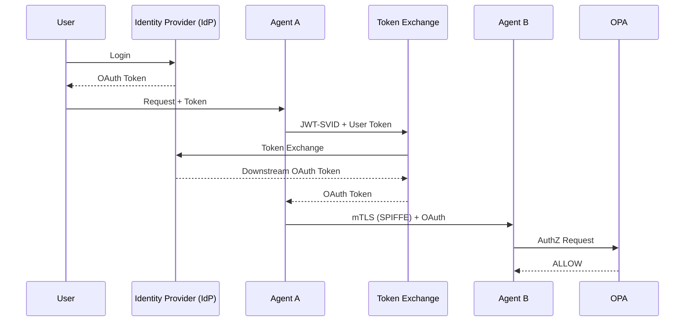

# Agent-to-Agent Auth — Design Q&A + Diagrams (Staff / Principal / Security)

> **Purpose**: Design-ready notes + deep understanding of modern agent-to-agent security using **SPIFFE/SPIRE**, **OAuth (Identity Provider (IdP))**, **OPA**, and **Service Mesh**.
> 
> Targeted for **Senior / Staff / Principal / Security Engineering**

---

## 1. Core Design Narrative (How to Explain in 60 Seconds)

**Answer**:
> "In modern distributed systems, we separate concerns: SPIFFE provides cryptographic workload identity and mTLS inside the system, OAuth handles user and external identity at the boundaries, and OPA makes fine-grained, runtime authorization decisions. As agent count grows, OAuth moves to the edges while SPIFFE + OPA form the internal zero-trust core."

---

## 2. SPIFFE / SPIRE — Design Q&A

### Q: What is SPIFFE?
**A:** SPIFFE (Secure Production Identity Framework For Everyone) is a standard for issuing **cryptographic identities to workloads**. It defines how services prove *who they are* using certificates or JWTs.

---

### Q: What problem does SPIFFE solve that OAuth doesn’t?
**A:** OAuth is user- and token-centric. SPIFFE is workload-centric and cryptographic. SPIFFE eliminates shared secrets, enables automatic rotation, and supports zero-trust service-to-service communication.

---

### Q: Is SPIFFE an IAM system?
**A:** No. SPIFFE does authentication only (AuthN). It does not manage users, roles, permissions, or policies.

---

### Q: What is SPIRE?
**A:** SPIRE is the reference implementation of SPIFFE. It attests workloads (Kubernetes, VMs, cloud metadata) and issues identities (SVIDs).

---

### Q: What are SVIDs?
**A:** SPIFFE Verifiable Identity Documents:
- **X.509 SVID** → mTLS
- **JWT-SVID** → token-based auth / exchange

---

## 3. OAuth / Identity Provider (IdP) — Design Q&A

### Q: What role does Identity Provider (IdP) play in this architecture?
**A:** Identity Provider (IdP) is an Identity Provider (IdP). It authenticates users and issues OAuth/OIDC tokens. It is not responsible for fine-grained authorization.

---

### Q: Why not use OAuth scopes for everything?
**A:** Scopes are static and issued at login time. As systems grow, scopes explode and cannot encode runtime context (agent identity, resource instance, time, risk). This leads to over-permission and brittle systems.

---

### Q: Does OAuth disappear as agents increase?
**A:** No. OAuth moves to the **edges**—user ingress, partner egress, and legacy compatibility—while SPIFFE replaces OAuth internally.

---

## 4. OPA (Open Policy Agent) — Design Q&A

### Q: What is OPA?
**A:** OPA (Open Policy Agent) is a general-purpose **policy decision engine**. It evaluates authorization policies at request time using full context.

---

### Q: How is OPA different from Identity Provider (IdP)?
**A:** Identity Provider (IdP) authenticates identities and issues tokens. OPA evaluates whether a specific action is allowed *right now*.

---

### Q: Why not let the IdP handle authorization?
**A:** IdPs evaluate policy only at token issuance. OPA evaluates policy per request, supports rich context, and avoids scope explosion.

---

### Q: Is OPA tied to Kubernetes or service mesh?
**A:** No. OPA is infrastructure-agnostic. It integrates naturally with service meshes but can run anywhere.

---

## 5. End-to-End Agent-to-Agent Flow (Design Gold)

### Step-by-step explanation

1. User authenticates via Identity Provider (IdP) → OAuth token issued
2. Agent A authenticates via SPIFFE → gets SVID
3. Agent A calls Agent B using mTLS (SPIFFE)
4. Optional: Agent A exchanges SPIFFE identity + user token for downstream OAuth token
5. Agent B validates identity
6. Agent B queries OPA
7. OPA returns ALLOW/DENY

---

## 6. Sequence Diagrams

### 6.1 Full Flow (Mermaid)



---

### 6.2 Internal-Only Agent Call (ASCII)

```
Agent A          Envoy        OPA        Agent B
   |               |           |           |
   |--- mTLS ----->|           |           |
   |               |--check--> |           |
   |               |<-ALLOW--- |           |
   |-------------------------------------->|
```

---

## 7. OPA Deployment Models — Design View

### Q: Sidecar vs Central OPA?

**Sidecar (most common)**
- Low latency
- Mesh-friendly
- Scales linearly

**Centralized**
- Easier governance
- Higher latency
- Larger blast radius

**Embedded**
- Gateways, CLIs
- Tight coupling

---

## 8. Service Mesh vs Service Registry (Clear Distinction)

### Service Mesh
- mTLS
- Traffic interception
- Identity propagation

### Service Registry
- Discovery
- Health checks

### OPA
- Authorization only

---

## 9. Common Mistakes & Anti-Patterns (Very Important)

### ❌ Using OAuth scopes as a policy engine
- Leads to scope explosion
- Hard to audit
- No runtime context

---

### ❌ Letting SPIRE do authorization
- Breaks separation of concerns
- Creates central blast radius
- Violates zero-trust principles

---

### ❌ Hardcoding authorization in services
- Inconsistent logic
- No global visibility
- Impossible to evolve safely

---

### ❌ Central OPA for high-QPS data paths
- Latency issues
- Scaling bottlenecks

---

### ❌ Treating service mesh RBAC as sufficient
- Mesh RBAC is coarse
- Cannot express business rules

---

## 10. Staff / Principal-Level Talking Points

- "Identity and authorization must be decoupled."
- "Workload identity scales better than token-based trust."
- "Authorization must be evaluated at request time, not login time."
- "OAuth is an interoperability format, not a trust fabric."
- "Zero trust requires continuous authorization."

---

## 11. Final Design TL;DR

- **SPIFFE/SPIRE** → workload identity & mTLS
- **Identity Provider (IdP)/OAuth** → user identity & federation
- **OPA** → fine-grained authorization
- **Service Mesh** → traffic + identity propagation

> Together, they form a scalable, zero-trust, agent-first security architecture.

